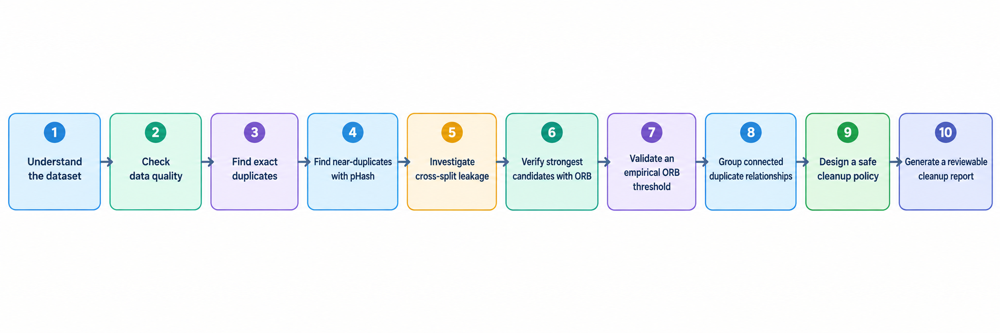

# Notebook Experiments — Dataset Preparation & Duplicate Analysis

This document summarizes the dataset preparation and duplicate-analysis work performed before model training.

## 1. Dataset Overview

The dataset contains **10,778 images** across 9 domestic-animal classes:

- Buffalo, Camel, Horse, Pig, Cat, Donkey, Sheep, Chicken, Goat

| Split | Images |
|---|---:|
| Train | 5,597 |
| Validation | 2,317 |
| Test | 2,864 |
| **Total** | **10,778** |

The first step was to understand class distribution, image dimensions, file formats, and color modes before training.

---

## 2. Dataset Quality Check

We checked:

- Supported image formats
- Corrupted/unreadable images
- Image dimensions
- Color modes (RGB, RGBA, grayscale, etc.)
- Basic visual quality

**Result:** No corrupted images were found.

The dataset contains varied image sizes and color modes, so preprocessing should handle these differences consistently.

---

## 3. Exact Duplicate Detection

We checked whether the same image file/content appeared more than once.

**Result:**

- 10,723 unique images
- 37 exact-duplicate groups
- No exact duplicates were found across different dataset splits

This confirmed that simple file-level duplication was not the main leakage problem.

---

## 4. Near-Duplicate Detection with pHash

Exact matching cannot detect resized, recompressed, or slightly modified copies. Therefore, **perceptual hashing (pHash)** was used.

Images with small pHash distances were treated as possible near-duplicates.

Using a pHash distance threshold of **5**:

- 766 near-duplicate pairs were detected
- 382 involved different dataset splits
- 704 unique images were involved in cross-split relationships

This produced candidates for further verification.

---

## 5. Cross-Split Leakage Investigation

The main concern was whether visually identical or nearly identical images existed in:

- Train ↔ Validation
- Train ↔ Test
- Validation ↔ Test

A particularly strong group of candidates had **pHash distance = 0**, meaning the images had identical perceptual hashes.

There were **333 such cross-split candidates**.

These were not automatically removed because pHash alone can produce false positives.

---

## 6. Visual Verification with ORB

Candidate pairs were verified using **ORB feature matching**.

Process:

1. Detect ORB keypoints and descriptors.
2. Match descriptors using Hamming distance.
3. Apply Lowe's ratio test.
4. Use RANSAC homography to identify geometrically consistent matches.
5. Count the resulting inliers.

Configuration:

- ORB features: up to 1,000
- Lowe ratio: 0.75
- RANSAC reprojection threshold: 5.0

This provided stronger evidence that two images represented the same underlying image.

---

## 7. Empirical ORB Threshold

Instead of choosing an arbitrary ORB threshold, borderline cases were manually inspected.

Five examples had ORB inlier counts of:

**11, 16, 20, 26, 47**

All were confirmed to represent the same underlying image.

Therefore, **11 ORB inliers** was adopted as the project-specific working threshold.

Final confirmation rule:

> **pHash distance = 0 AND ORB inliers ≥ 11**

---

## 8. Confirmed Duplicate Relationships

Applying the final rule produced:

**293 confirmed duplicate relationships**

| Split combination | Relationships |
|---|---:|
| Train ↔ Test | 148 |
| Train ↔ Validation | 93 |
| Validation ↔ Test | 52 |
| **Total** | **293** |

These relationships were then grouped to identify connected sets of duplicate images.

---

## 9. Duplicate Groups

The 293 relationships formed **264 connected duplicate groups**.

A group can contain more than two images when the same underlying image appears in multiple files or splits.

The largest groups contained up to 6 related images.

Grouping was important because removing duplicates pair-by-pair could leave another duplicate behind.

---

## 10. Cleanup Policy

Duplicates were not permanently deleted immediately.

The final retention priority was:

**Train > Test > Validation**

Meaning:

- Keep a Train copy when available.
- Otherwise keep Test.
- Otherwise keep Validation.
- Keep one representative image within the preferred split.
- Remove redundant copies from other splits and redundant copies within the same split.

This policy avoids unnecessary loss of training data while preventing the same image from appearing across evaluation boundaries.

---

## 11. Cleanup Recommendation

The final report recommended **285 images for quarantine**:

| Kept split | Removed split | Images |
|---|---|---:|
| Train | Test | 138 |
| Train | Validation | 83 |
| Test | Validation | 49 |
| Train | Train | 15 |
| **Total** | | **285** |

The 15 Train → Train removals were redundant copies within the training set itself.

No Test or Validation image was removed in favor of a lower-priority split.

---

## 12. Quarantine Instead of Permanent Deletion

The recommended files were moved to a separate **quarantine** directory rather than permanently deleted.

Result:

- 285 moved
- 0 missing
- 0 errors

A `quarantine_log.csv` records the operation.

This makes the cleanup reversible and allows the dataset to be reviewed before permanent deletion.

---

## 13. Final Workflow

## 14. Important Notes

- Duplicate detection is separate from model training.
- pHash was used for candidate generation, not final confirmation.
- ORB + RANSAC provided the final verification.
- The **11-inlier threshold is empirical and specific to this project**.
- Cleanup reports are recommendations; files should not be permanently deleted without final verification.
- The quarantined images should **not simply be added back to training just to increase the dataset size**. They should remain available as a backup until the cleanup is fully validated.

## Results Summary

| Stage | Result |
|---|---:|
| Original images | 10,778 |
| Exact duplicate groups | 37 |
| Cross-split pHash candidates | 382 |
| Confirmed duplicate relationships | 293 |
| Connected duplicate groups | 264 |
| Recommended for quarantine | 285 |
| Successfully quarantined | 285 |

The dataset is now prepared for the next stage: **consistent preprocessing and model training/evaluation**.
